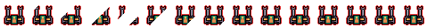
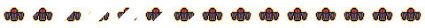
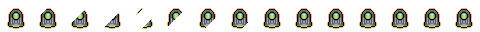
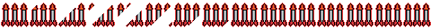
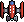
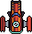
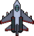
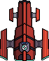

# Space-Pygame
2D Top-down rogue-lite space shooter with progressive difficulty built using pygame and OOP.

Can be played using one hand only

## Requirements
* Python 3.10 or above recommended
* have pygame installed (run `pip install pygame` in terminal)
* run game.py

## How to play
- WASD to move
- Spacebar to shoot
- LShift to fire missile
- ESC to pause
- B to toggle autofire (only when autofire is activated)

## Items
* +HP
  

+10 HP when picked up

* +ATK

Each laser deducts one more enemy hp when picked up

* +SPD

Player moves slightly faster after pick up

* +LSPD

Player laser speed increases slightly after pick up

* AUTO

Enables auto firing, increases auto firing speed if auto firing is enabled already

* WEAPONUP

Increases weapon tier

* MISSILE

Increases amount of missiles in reserve

## Enemies
There are 4 types of enemies
### Fighter

Very fragile, and have a weak attack, but they come in a bunch

### Elite

Stronger than fighter, shoots more lasers and has thicker armor

### Kamikaze

Shoots no lasers, its only goal is to die with you

### Big Boy

The chunky one, shoots many lasers, many hp, but very slow
